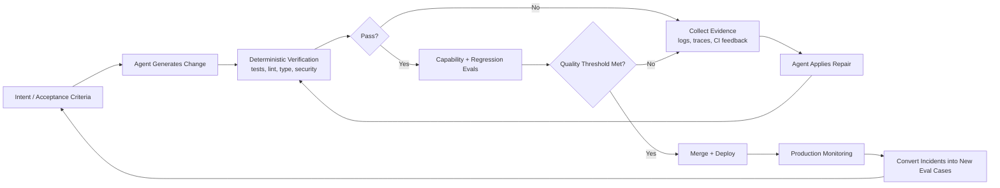

# Closing the Loop: How to Get Better Features, Not Just More AI Code

The biggest mistake teams can make with AI coding agents is simple: they optimize for code output, not product outcomes.

Agentic tools can now generate, refactor, and patch code at a speed that breaks old intuitions about engineering effort. But the hard part of software has never been typing. The hard part is shipping behavior that is correct, reliable, and maintainable under real constraints.

That is why “writing code is cheap now” should not be read as a victory lap. It should be read as a design constraint. If code generation is cheap, then verification becomes the dominant cost center [1](https://simonwillison.net/guides/agentic-engineering-patterns/code-is-cheap/).

The strategic question for modern teams is no longer “How do we generate more code with AI?” It is “How do we close the loop so AI systems produce higher-quality features with less routine human intervention?”

## TL;DR

- Fast code generation shifts the bottleneck to verification, not implementation [1](https://simonwillison.net/guides/agentic-engineering-patterns/code-is-cheap/).
- “Closing the loop” means every AI change must pass executable checks, evals, and evidence-based repair before shipping [2](https://www.anthropic.com/engineering/demystifying-evals-for-ai-agents) [4](https://openai.com/index/harness-engineering/) [5](https://developers.openai.com/api/docs/guides/evals).
- Telemetry (logs, traces, metrics) is mandatory runtime ground truth for reliable self-correction [4](https://openai.com/index/harness-engineering/) [8](https://arize.com/blog/closing-the-loop-coding-agents-telemetry-and-the-path-to-self-improving-software/).
- Human effort should move to architecture and risk decisions; mechanical defect handling should be automated [4](https://openai.com/index/harness-engineering/) [7](https://cognition.ai/blog/closing-the-agent-loop-devin-autofixes-review-comments).

### Key takeaways

1. Optimize for resolved features and defect prevention, not lines of generated code.
2. Treat evals as first-class product infrastructure, not optional QA overhead [2](https://www.anthropic.com/engineering/demystifying-evals-for-ai-agents) [5](https://developers.openai.com/api/docs/guides/evals).
3. Convert every escaped incident into a new regression case so quality compounds over time.

## Code Is Cheap; Confidence Is Not

Simon Willison’s framing captures the shift with unusual clarity: the cost of producing code has dropped sharply, but the cost of **good code** has not [1](https://simonwillison.net/guides/agentic-engineering-patterns/code-is-cheap/).

Good code still requires:
- correct behavior under real inputs,
- explicit validation that behavior is correct,
- graceful handling of error paths,
- regression protection,
- and documentation that remains true as the system evolves.

AI can help with each of these, but none happen automatically. In practice, many teams still run an open-loop process:

`prompt -> generate diff -> skim review -> merge`

That process can increase velocity in the short term while silently increasing defect escape rate, review fatigue, and architectural drift.

## What “Closing the Loop” Actually Means

Closing the loop means engineering your delivery system so every agent-generated change is forced through measurable feedback before it ships.

Anthropic’s eval work, OpenAI’s harness engineering lessons, and real-world agent-review systems converge on the same pattern: generation must be coupled to execution, measurement, diagnosis, and iterative repair [2](https://www.anthropic.com/engineering/demystifying-evals-for-ai-agents) [4](https://openai.com/index/harness-engineering/) [7](https://cognition.ai/blog/closing-the-agent-loop-devin-autofixes-review-comments).

In practical terms, the loop looks like this:

A loop is “closed” when production failures feed back into the eval suite, so the same class of failure is less likely to recur.

## Why Closed Loops Produce Better Features

Closed loops improve outcomes because they make quality executable.

### 1. Deterministic checks enforce baseline correctness
For coding tasks, pass/fail checks remain the highest-signal first layer: tests, static analysis, and safety/security checks [2](https://www.anthropic.com/engineering/demystifying-evals-for-ai-agents) [5](https://developers.openai.com/api/docs/guides/evals) [6](https://www.swebench.com/verified.html).

### 2. Evals preserve product memory
Capability and regression evals keep teams from re-litigating quality on every PR. They also let teams compare model and prompt changes empirically instead of by anecdote [2](https://www.anthropic.com/engineering/demystifying-evals-for-ai-agents) [5](https://developers.openai.com/api/docs/guides/evals).

### 3. Telemetry provides runtime ground truth
Source code tells you what should happen. Traces and metrics tell you what actually happened in the real execution path. Agents that can query telemetry are dramatically better positioned to self-correct [4](https://openai.com/index/harness-engineering/) [8](https://arize.com/blog/closing-the-loop-coding-agents-telemetry-and-the-path-to-self-improving-software/).

### 4. Automated repair reduces mechanical review load
Agent-to-agent review and bot-triggered autofix loops are effective at removing low-judgment defects before humans ever look at the PR [7](https://cognition.ai/blog/closing-the-agent-loop-devin-autofixes-review-comments).

This is the key transition: humans stop being line-by-line error catchers and become system designers and escalation judges.

## Human-In-The-Loop: Move Up, Don’t Disappear

The goal is not zero humans. The goal is **zero wasted human cycles on mechanical defects**.

A useful operating split:
- **Automate**: formatting, lint violations, deterministic test regressions, straightforward static-analysis fixes.
- **Escalate**: ambiguous requirements, architecture trade-offs, trust-boundary changes, migration risk, and user-impact judgment.

OpenAI’s harness engineering write-up describes this as a shift from writing code to designing scaffolding, constraints, and feedback loops that keep generated code coherent over time [4](https://openai.com/index/harness-engineering/).

## Common Failure Modes

### 1. Mistaking throughput for quality
PR count and lines changed are activity metrics, not outcome metrics.

### 2. Building brittle evals
Over-constrained graders can reject valid solutions and optimize for test artifacts rather than user outcomes [2](https://www.anthropic.com/engineering/demystifying-evals-for-ai-agents).

### 3. Running agents without observability access
If the agent cannot inspect traces/logs/metrics, it is debugging blind and will rely on guesswork [4](https://openai.com/index/harness-engineering/) [8](https://arize.com/blog/closing-the-loop-coding-agents-telemetry-and-the-path-to-self-improving-software/).

### 4. Relying on giant instruction files
Monolithic “prompt bibles” decay quickly. Structured, versioned, discoverable in-repo knowledge is more robust [4](https://openai.com/index/harness-engineering/).

## Small Steps

Below is a practical menu for corporate software teams. Start small, then stack controls deliberately.

### 1. Turn branch protection into a quality gate
Require passing status checks and required reviews on protected branches so agent-generated PRs cannot bypass baseline quality controls [9](https://docs.github.com/en/repositories/configuring-branches-and-merges-in-your-repository/managing-protected-branches).

### 2. Standardize a minimum verification bundle per PR
Make tests, lint, type checks, and security scanning non-optional for merges; keep this bundle consistent across repositories to reduce policy drift [2](https://www.anthropic.com/engineering/demystifying-evals-for-ai-agents) [10](https://csrc.nist.gov/pubs/sp/800/218/final).

### 3. Create a “defect-to-eval” policy
Every escaped incident should become a regression test or eval task within one sprint so the system learns from production failures [2](https://www.anthropic.com/engineering/demystifying-evals-for-ai-agents).

### 4. Instrument one end-to-end flow with traces, metrics, and logs
Use a common telemetry model so both humans and agents can verify runtime behavior against expected outcomes [4](https://openai.com/index/harness-engineering/) [8](https://arize.com/blog/closing-the-loop-coding-agents-telemetry-and-the-path-to-self-improving-software/) [11](https://opentelemetry.io/docs/what-is-opentelemetry/).

### 5. Introduce one operational feature flag per critical service
Add kill-switch/ops toggles for graceful degradation and safer progressive rollout under load or incidents [12](https://martinfowler.com/articles/feature-toggles.html).

### 6. Define 2–3 team-level outcome metrics
Track lead indicators and quality outcomes together (for example: change failure rate, restore time, regression pass rate) to avoid “more code” vanity metrics [13](https://dora.dev/).

## Levers to tap in a corporate environment

### 1. Governance lever: make quality policy executable
Encode AI development controls in engineering standards and SDLC policy (not slide decks), aligned to NIST AI RMF and SSDF outcomes for governance, measurement, and response [10](https://csrc.nist.gov/pubs/sp/800/218/final) [14](https://www.nist.gov/itl/ai-risk-management-framework).  

Require evidence artifacts for promotion (test/eval reports, provenance, and incident risk notes) for regulated or high-impact systems [10](https://csrc.nist.gov/pubs/sp/800/218/final) [15](https://slsa.dev/spec/v1.0/levels).

### 2. Platform lever: provide paved roads
Offer a shared internal platform with prebuilt CI templates, eval harness scaffolds, and observability defaults so product teams do not reinvent controls per repo [2](https://www.anthropic.com/engineering/demystifying-evals-for-ai-agents) [4](https://openai.com/index/harness-engineering/) [13](https://dora.dev/).

Make the “safe path” fastest: one command to run local quality gates that match CI semantics.

### 3. Release lever: separate deployment from exposure
Use feature flags/canary cohorts to release safely while controlling blast radius and gathering real signals before broad exposure [12](https://martinfowler.com/articles/feature-toggles.html).

Tie rollout progression to measurable thresholds (error budget burn, quality eval pass rates) rather than calendar dates [6](https://www.swebench.com/verified.html) [16](https://sre.google/workbook/alerting-on-slos/).

### 4. Operations lever: alert on user impact, not noise
Build alerting from SLO/SLI and error-budget policies to prioritize urgent, actionable issues and reduce pager fatigue [16](https://sre.google/workbook/alerting-on-slos/) [17](https://sre.google/sre-book/monitoring-distributed-systems/).

Reserve paging for events that need human judgment; auto-remediate rote issues where possible [17](https://sre.google/sre-book/monitoring-distributed-systems/).

### 5. Security and supply-chain lever: harden trust boundaries
Incrementally adopt software provenance and build-hardening controls (e.g., SLSA-aligned levels) for release integrity and tamper resistance [15](https://slsa.dev/spec/v1.0/levels).

Treat GenAI-specific security as first-class in threat modeling and review checklists (prompt/input abuse, data leakage, tool misuse) [18](https://genai.owasp.org/llm-top-10/).

### 6. Org design lever: rebalance responsibilities
Shift human effort upward: architecture, product trade-offs, and risk acceptance remain human-owned; mechanical verification and repair loops are automated [4](https://openai.com/index/harness-engineering/) [7](https://cognition.ai/blog/closing-the-agent-loop-devin-autofixes-review-comments).

Assign explicit ownership for eval suites and telemetry quality—without named owners, loops decay.

## The Real Competitive Advantage

As coding gets cheaper, discipline shifts layers.

In high-performing agentic teams, the strategic moat is not raw generation speed. It is the quality of the harness around generation: eval design, telemetry access, reproducibility, guardrails, and repair automation.

Teams that close the loop ship better features faster.
Teams that don’t close the loop ship more code faster.

Those are not the same thing.

